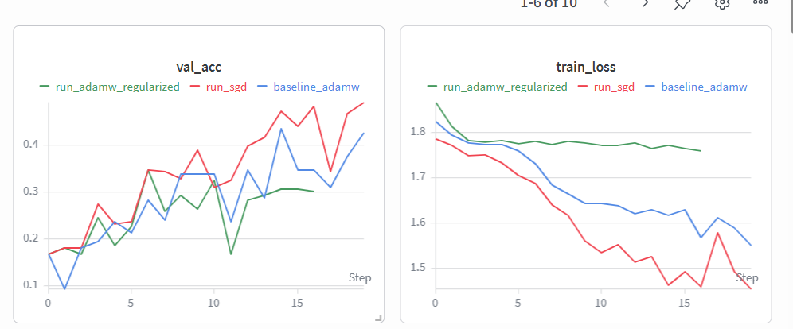
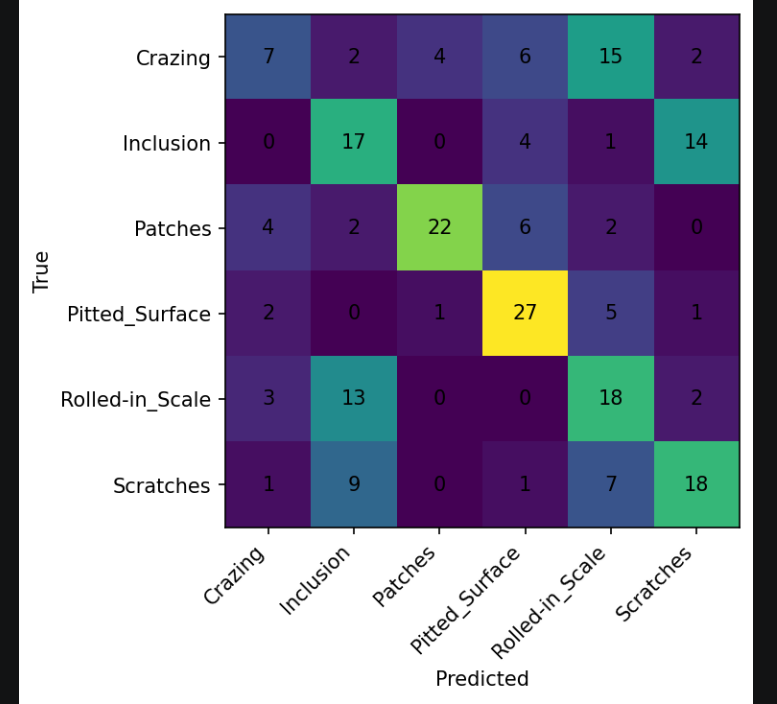

CSC4005 – BÁO CÁO LAB 1: TRAINING & REGULARIZATION

Sinh viên: Nguyễn Quang Duy

Mã sinh viên: 1771040009

Link W&B Project: https://wandb.ai/quangduy772005-dai/csc4005-lab1-neu-mlp

1. Mục tiêu bài thực hành

Mục tiêu: Xây dựng và huấn luyện mạng MLP để phân loại 6 loại lỗi bề mặt thép từ bộ dữ liệu NEU-CLS.

Yêu cầu đạt được: Sử dụng thành thạo Weights & Biases (W&B) để quản lý thí nghiệm, so sánh các Optimizer (AdamW, SGD) và hiểu về ảnh hưởng của Regularization (Dropout).

2. Cấu hình thí nghiệm

Em đã thực hiện huấn luyện 3 cấu hình khác nhau để tìm ra mô hình tối ưu:

Cấu hình 1: Run 1 (Baseline)

Bộ tối ưu (Optimizer): AdamW

Tốc độ học (Learning Rate): 0.001

Số vòng lặp (Epochs): 20

Dropout: 0.3

Mục tiêu: Làm mốc so sánh cơ bản.

Cấu hình 2: Run 2 (SGD - Best)

Bộ tối ưu (Optimizer): SGD

Tốc độ học (Learning Rate): 0.01

Số vòng lặp (Epochs): 20

Dropout: 0.3

Mục tiêu: Thử nghiệm thuật toán SGD với tốc độ học cao hơn.

Cấu hình 3: Run 3 (Regularization)

Bộ tối ưu (Optimizer): AdamW

Tốc độ học (Learning Rate): 0.001

Số vòng lặp (Epochs): 40 (Dừng sớm ở Epoch 17)

Dropout: 0.5

Mục tiêu: Tăng cường chống Overfitting bằng cách tăng Dropout.

3. Kết quả thí nghiệm

3.1. Kết quả Metrics chi tiết

Run 1 (baseline_adamw):

Train Accuracy: 34.62%

Val Accuracy: 42.59%

Test Accuracy: 45.37%

Trạng thái: Hoạt động ổn định nhưng kết quả chưa cao.

Run 2 (run_sgd):

Train Accuracy: 40.08%

Val Accuracy: 49.07%

Test Accuracy: 50.46%

Trạng thái: Kết quả tốt nhất trong 3 lần chạy.

Run 3 (run_adamw_regularized):

Train Accuracy: 20.64%

Val Accuracy: 30.09%

Test Accuracy: 17.59%

Trạng thái: Bị hiện tượng Underfitting.

3.2. Biểu đồ học tập (Learning Curves)

3.3. Đánh giá mô hình tốt nhất (Run 2 - SGD)

Ma trận nhầm lẫn (Confusion Matrix): 

Nhận xét: Mô hình phân loại tốt nhất ở các lớp Patches và Inclusion. Lớp Crazing vẫn còn bị nhầm lẫn nhiều do đặc điểm hình ảnh phức tạp mà mạng MLP chưa xử lý triệt để.

4. Phân tích kết quả

Cấu hình tốt nhất: Run 2 (run_sgd) sử dụng thuật toán SGD mang lại hiệu quả cao nhất. Việc tăng Learning Rate lên 0.01 giúp SGD hội tụ tốt hơn so với AdamW ở mức 0.001 trên bộ dữ liệu này.

Dấu hiệu Underfitting: Run 3 cho thấy khi tăng Dropout lên quá cao (0.5), mô hình bị "ngạt", không thể học được các đặc trưng quan trọng từ dữ liệu, dẫn đến kết quả tệ nhất.

So sánh Optimizer: Trên bộ dữ liệu NEU, SGD cho thấy khả năng tổng quát hóa tốt hơn AdamW khi được thiết lập thông số phù hợp.

5. Kết luận

Cấu hình đề xuất: Optimizer SGD, LR 0.01, Epochs 20, Dropout 0.3.

Lý do: Đạt độ chính xác cao nhất (50.46%) và biểu đồ Loss giảm ổn định nhất.

Bài học: Việc chọn siêu tham số cần dựa trên thực nghiệm. W&B là công cụ cực kỳ quan trọng để quản lý và so sánh kết quả một cách khách quan.